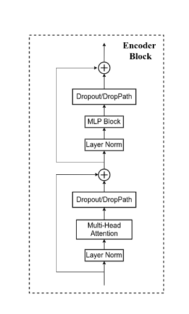

# Vision Transformer 学习笔记

## 模型结构与其实现

### 概述


Transformer模型起初用于NLP领域，是一种序列到序列模型。迁移到CV领域，起初是CNN与self attention相结合的模型，2021年google提出一种standard Transformer模型。

其基本由三部分组成：Patch+Position Embedding：为了降低计算复杂性，ViT将原始图片分为一个个小的patch来捕获局部特征；

Transformer Encoder：模型主干，输出学习到的特征；

MLP Head：作为下游分类任务，用于类别提取与最后的分类。


### Patch embedding and projection


将2D的图像转换成序列作为Transformer的输入：

以RGB三通道图像 $3\times224\times224$ 为例，若设定patch size=16，则将一幅图片分成 $\frac{224 \times 224}{16 \times 16}=196$ 个大小为$3\times16\times16$的patches。并将每个patch  $3\times16\times16$  拉直(flatten)投影成向量 $1\times768$ ，再将196个patch的向量堆叠在一起，形成矩阵 $196 \times 768$ ，作为下一步的输入。

实际应用中，模型的输入通常是四维的：$batch\ size\times channel \times height \times width$

```python
self.projection = nn.Sequential(
                Rearrange('b c (h s1) (w s2) -> b (h w) (s1 s2 c)', s1=patch_size, s2=patch_size),
                nn.Linear(patch_size * patch_size * in_channel, embed_dim)
            )
```

- 输入张量的形状是 'b c (h s1) (w s2)'，将高度与宽度以s1和s2大小进行拆分。
- 输出张量的形状是 'b (h w) (s1 s2 c)'。 'h w' 表示将高度和宽度合并成一个维度，而 '(s1 s2 c)' 表示原始通道数和步幅参数在最后一个维度中合并。

但是在vision transformer的具体实现中，通常采用一个二维卷积核对原始图像进行分割，卷积核的大小与patch大小一致，每个卷积核都会输出196个特征信息，共有768个卷积核对其扫描，输出矩阵的维度仍然是 $196\times768$ 。

```python
self.projection = nn.Sequential(
                nn.Conv2d(in_channel, embed_dim, kernel_size=patch_size, stride=patch_size),
                Rearrange('b e h w -> b (h w) e')
            )
```

`Rearrange('b e h w-> b (h w) e')` 指将hw合并成一个维度，并随后做转置，将通道数移动到最后一维。

### class token and positon embedding

ViT的输入大小与输出大小一致，为了最后进行类别的判别，vision transformer引入cls token，这是一个可以学习的参数，最后用一个全连接层进行分类预测。所以，模型的输入就从$batch\ size \times 196 \times 768 \to batch\ size \times 197 \times 768$ .

position embedding （$batch\ size \times 197\times768$）也是一个可以学习的参数，位置越近，越具有相似的位置编码。因为ViT是基于attention机制的，所以在处理序列数据时会丢失位置信息，无法像CNN一样保留位置信息，position embedding使得ViT能够patch之间的位置关系与空间结构。但实验表明，位置编码对于最终的结果并没有太大的影响。一维位置编码相对于没有编码的准确率上升了3%，而其他方式的位置编码效果差异不大。


至此已经完成了patch embedding、class token和position embedding。

### MLP Block


利用多层感知机对提取的特征进行进一步的处理，其结构如上：线性全连接层—>激活函数—>dropout—>全连接—>dropout。

- GELU的定义如下：
$$
GELU(x)= \frac{1}{2}x(1+tanh( \sqrt{\frac{π}{2}}(x+0.044715x^3)))
$$
- dropout丢弃一些节点的连接，使得MLP的泛化能力更强。

```python
class Mlp(nn.Module):
    def __init__(self, in_features, hidden_features=None, out_features=None, drop_prob=0.):
        super().__init__()
        out_features = out_features or in_features
        hidden_features = hidden_features or in_features
        self.linear1 = nn.Linear(in_features, hidden_features)
        self.gelu = nn.GELU()
        self.drop1 = nn.Dropout(drop_prob)
        self.linear2 = nn.Linear(hidden_features, out_features)
        self.drop2 = nn.Dropout(drop_prob)

    def forward(self, x):
        x = self.linear1(x)
        x = self.gelu(x)
        x = self.drop1(x)
        x = self.linear2(x)
        x = self.drop2(x)
        return x
```

### Multi Head Attention

多头的attention是每一个输入向量都由多个q，k和v进行attention操作。

- q：query对每一个k进行匹配，计算出attention
- k：key，被每个q匹配，计算出attention
- v：value，需要被提取的信息，与attention进行计算

输入向量$x$ ，分别和三个不同的矩阵$W^q\  W^k\  W^v$ 相乘获得对应的q，k，v。
$$
\ \ \ \ \ \ \ \ \ \ \ \ \ \ \ \ \ \ \ \ \ q^i\\
\ \ \ \ \ \ \ \ \ \ \ \nearrow \\
x^i\rightarrow a^i \rightarrow k^i    \\
\ \ \ \ \ \ \ \ \ \ \ \searrow\\
\ \ \ \ \ \ \ \ \ \ \ \ \ \ \ \ \ \ \ \ \ v^i \\
$$


q会匹配每一个k，进行softmax后得到一个分数，原则上只要attention可以获得一个分数就可以输出结果。

$\alpha$ 的计算公式如下，但是在复现中，会将多个向量组成矩阵进行计算
$$
\hat \alpha_{1,i}=softmax(\frac{q^1\cdot k^i}{\sqrt{d}})
$$
$d$ 代表$q,k$ 的维度，最终的输出向量为
$$
b^1=\sum\hat\alpha_{1,i}v^i
$$
实际操作中，会像如下所示进行矩阵计算


```python
self.qkv = nn.Linear(dim, dim * 3)
```

会用一个全连接层对输入张量进行变换，仍以$b \times 197 \times 768$ 的张量为例
$$
\begin{bmatrix}
a_{11} & a_{12} & \cdots & a_{1m} \\
a_{21} & a_{22} & \cdots & a_{2m} \\
\vdots & \vdots & \vdots & \vdots \\
a_{n1} & a_{n2} & \cdots & a_{nm} \\
\end{bmatrix}_{197\times768}
\begin{bmatrix}
a_{11} & a_{12} & \cdots & a_{1m} \\
a_{21} & a_{22} & \cdots & a_{2m} \\
\vdots & \vdots & \vdots & \vdots \\
a_{n1} & a_{n2} & \cdots & a_{nm} \\
\end{bmatrix}_{768\times(768\times3)}=
\begin{bmatrix}
a_{11} & a_{12} & \cdots & a_{1m} \\
a_{21} & a_{22} & \cdots & a_{2m} \\
\vdots & \vdots & \vdots & \vdots \\
a_{n1} & a_{n2} & \cdots & a_{nm} \\
\end{bmatrix}_{197\times(768\times3)}
$$

```python
qkv = rearrange(self.qkv(x), 'b n (qkv h d) -> (qkv) b h n d', h=self.num_heads, qkv=3)
```

对这个$b\times197\times(768\times3)$ 的矩阵进行变换，初始化q，k和v。由于有多个qkv进行匹配计算，所以需要矩阵拆分，将维度扩大，为$3\times head\ numbers\times dimension$

以12个attention头为例，
$$
b\times197\times(768\times3)\rightarrow b\times197\times3\times12\times64\rightarrow 3\times b\times12\times197\times64
$$

```python
q, k, v = qkv[0], qkv[1], qkv[2]
```

$$
q,k,v\ \ \ \ dimension=12\times197\times64
$$

因为需要q的分量去和每一个k的分量进行匹配，所以需要将k转置相乘。

```python
alpha = (q @ k.transpose(-2, -1)) * self.scale
```


$$
\begin{bmatrix}
 \cdots
\end{bmatrix}_{12\times197\times64}
\begin{bmatrix}
 \cdots
\end{bmatrix}_{12\times64\times197}=
\begin{bmatrix}
 \cdots
\end{bmatrix}_{12\times197\times197}
$$

```python
attention = alpha.softmax(dim=-1)
```

$$
\hat \alpha_{1,i}=softmax(\alpha)= \frac{e^{x_{i}}}{\sum{e^{x_{j}}}}
$$

$\hat \alpha$包含了相对于每个位置的注意力分数，`softmax(dim=-1)` 的操作会在最后一个维度上应用 softmax 函数，使这些分数归一化为概率分布，以便在后续步骤中用于提取v的信息。

```python
x = attention @ v
x = rearrange(x, "b h n d -> b n (h d)")
```

$$
\begin{bmatrix}
 \cdots
\end{bmatrix}_{12\times197\times197}
\begin{bmatrix}
 \cdots
\end{bmatrix}_{12\times197\times64}=
\begin{bmatrix}
 \cdots
\end{bmatrix}_{12\times197\times197}
$$

在用一个全连接层做后续的处理，输入输出维度保持不变。至此，attention块已经基本实现，可以发现特征图经过attention块后维度不会发生变化，所以可以堆叠任意多的attention进行计算（如果允许的话）

### layer norm


layer norm并不是对每个特征进行归一化，而是对每一个样本进行归一化。使用 Layer Norm 可以更好地与位置编码一起工作，因为它不会改变每个位置的特征的统计分布，有助于保留位置信息。之所以不用BN，是因为BN 倾向于将不同位置的特征映射到相似的统计分布，而不同位置的特征之间可能存在很大的差异，可能具有不同的统计分布。

### Dropout and Droppath

给定一个tensor[0.9，2.8] ，经过 dropout 后，会变成 ，[0.9，0] 或者 ，[0，2.8]，而对于droppath 会直接将这个 tensor 置为 [0，0]。即在ViT的encoder中，输入会在两层的残差网络中被置为0张量，残差块退化，解决过拟合。

.png)

```python
def drop_path(x, drop_prob: float = 0., training: bool = False):
    # eval mode, dont drop
    if drop_prob == 0. or not training:
        return x
    keep_prob = 1 - drop_prob
    shape = (x.shape[0],) + (1,) * (x.ndim - 1)
    random_tensor = keep_prob + torch.rand(shape, dtype=x.dtype, device=x.device)
    random_tensor.floor_()  # binarize
    output = x.div(keep_prob) * random_tensor
    return output
```

其中x除以保留概率是为了保持减少样本后的总体期望不变。

### Vision Transformer



根据上面的ViT结构，可以得到：

```python
class VisionTransformer(nn.Module):
    def __init__(self, img_size=224, patch_size=16, in_channels=3, num_classes=1000,
                embed_dim=768, depth=12, num_heads=12, mlp_expand: int=4, qkv_bias=True,
                qk_scale=None, representation_size=None, distilled=False, drop_prob=0.,
                atten_drop_prob=0., drop_path_prob=0., embed_layer=PatchEmbed):
        super().__init__()
        self.num_classes = num_classes  # need to be classified
        self.embed_dim = self.num_features = embed_dim  # the dimension after embedding
        self.patch_embed = embed_layer(img_size=img_size, patch_size=patch_size,
                                        in_channel=in_channels, embed_dim=embed_dim)
        self.dropout = nn.Dropout(p=drop_prob)

        dpr = [x.item() for x in torch.linspace(0, drop_path_prob, depth)]
        self.encoderblock = nn.Sequential(
            *[EncoderBlock(dim=embed_dim, num_heads=num_heads, mlp_expand=mlp_expand,
             			   qkv_bias=qkv_bias, qk_scale=qk_scale, drop_prob=drop_prob,
                   	 	   atten_drop_prob=atten_drop_prob, drop_path_prob=dpr[i])
                           for i in range(depth)])
        self.norm = nn.LayerNorm(embed_dim)

        # Classifier Head
        # pre-logit: -> a fully connected layer and active function
        if representation_size:
            self.has_logits = True
            self.num_features = representation_size
            self.pre_logits = nn.Sequential(OrderedDict([
                ("linear", nn.Linear(embed_dim, representation_size)),
                ("tanh", nn.Tanh())
            ]))
        else:
            self.has_logits = False
            self.pre_logits = nn.Identity()
        # linear
        self.classifier = nn.Linear(self.num_features, num_classes) if num_classes > 0 else nn.Identity()

    def forward(self, x):
        x = self.patch_embed(x) 
        x = self.dropout(x)
        x = self.encoderblock(x)
        x = self.norm(x)
        x = self.pre_logits(x[:, 0])
        x = self.classifier(x)
        return x
```

注意！在MLP块时候，特征图会先放大一定倍后再缩小。默认是4倍
$$
197\times768 \rightarrow 197\times3012\rightarrow 197\times768
$$


### Google 源码

google开源的Vi是基于flax神经网路库开发的，建立在jax上，可以进行优化的科学计算。

源码更加简洁，在源码的基础上增加一些注释。

但是可以发现，google实现ViT时候，增加了一个resnet的可选形参。当选择使用残差网络块时，会先对输入进行标准卷积和Resnet，然后才使用patch embedding，position embedding和attention等操作。


这是ViT模型的变体，采用了类似于ResNetv2的BiT架构，不同点在于所有批量归一化层替代为组归一化，卷积层采用权重标准化，对于大批次的数据友好，此外这种方法还可用于迁移学习。

### ViT模型变体简介

ViT不依赖图片局部性和平移不变性（CNN所固有的）的先验条件，更关注图像的全局关系，在小批量数据集上可能效果没有ResNet好。因此研究者们考虑将CNN与Transformer相结合，google考虑将ResNet和ViT结合，将ResNet提取到的特征作为Token输入，提高局部特征建模能力。


根据ViT变体的分类，该结构应该类似于Sequential Integration中的CoAtNet和BoTNet。其性能可能被bottleneck的设计和模型深度影响，但是通过增加残差结构，可以在纯ViT的基础上增强速度与效率，并且综合了CNN的局部相关性和Transformer的全局能力。

```python
from typing import Any, Callable, Optional, Tuple, Type

import flax.linen as nn
import jax.numpy as jnp

from vit_jax import models_resnet


Array = Any
PRNGKey = Any
Shape = Tuple[int]
Dtype = Any


class IdentityLayer(nn.Module):
  """Identity layer, convenient for giving a name to an array."""

  @nn.compact  # 定义紧凑函数，允许更加简洁的方法组织关联
  def __call__(self, x):  # 类似于Pytorch的nn.identity
    return x


# 增加位置编码
class AddPositionEmbs(nn.Module):
  """Adds learned positional embeddings to the inputs. 增加可学习的位置编码
  Attributes:
    posemb_init: positional embedding initializer.
  """

  posemb_init: Callable[[PRNGKey, Shape, Dtype], Array]  # 类的属性：1.随机密钥 2.形状 3.类型 返回数组

  @nn.compact
  def __call__(self, inputs):
    """Applies the AddPositionEmbs module.

    Args:
      inputs: Inputs to the layer.

    Returns:
      Output tensor with shape `(bs, timesteps, in_dim)`.
    """
    # inputs.shape is (batch_size, seq_len, emb_dim).
    assert inputs.ndim == 3, ('Number of dimensions should be 3,'
                              ' but it is: %d' % inputs.ndim)
    pos_emb_shape = (1, inputs.shape[1], inputs.shape[2])
    pe = self.param('pos_embedding', self.posemb_init, pos_emb_shape)
    return inputs + pe


class MlpBlock(nn.Module):
  """Transformer MLP / feed-forward block."""

  mlp_dim: int
  dtype: Dtype = jnp.float32
  out_dim: Optional[int] = None
  dropout_rate: float = 0.1
  kernel_init: Callable[[PRNGKey, Shape, Dtype],
                        Array] = nn.initializers.xavier_uniform()
  bias_init: Callable[[PRNGKey, Shape, Dtype],
                      Array] = nn.initializers.normal(stddev=1e-6)

  @nn.compact
  def __call__(self, inputs, *, deterministic):
    """Applies Transformer MlpBlock module."""
    actual_out_dim = inputs.shape[-1] if self.out_dim is None else self.out_dim
    x = nn.Dense(
        features=self.mlp_dim,  # 输出维度
        dtype=self.dtype,
        kernel_init=self.kernel_init,
        bias_init=self.bias_init)(  # pytype: disable=wrong-arg-types
            inputs)  # 全连接
    x = nn.gelu(x)  # 激活
    x = nn.Dropout(rate=self.dropout_rate)(x, deterministic=deterministic)  #dropout
    output = nn.Dense(
        features=actual_out_dim,
        dtype=self.dtype,
        kernel_init=self.kernel_init,
        bias_init=self.bias_init)(  # pytype: disable=wrong-arg-types
            x)
    output = nn.Dropout(
        rate=self.dropout_rate)(
            output, deterministic=deterministic)
    return output


class Encoder1DBlock(nn.Module):
  """Transformer encoder layer.

  Attributes:
    inputs: input data.
    mlp_dim: dimension of the mlp on top of attention block.
    dtype: the dtype of the computation (default: float32).
    dropout_rate: dropout rate.
    attention_dropout_rate: dropout for attention heads.
    deterministic: bool, deterministic or not (to apply dropout).
    num_heads: Number of heads in nn.MultiHeadDotProductAttention
  """

  mlp_dim: int
  num_heads: int
  dtype: Dtype = jnp.float32
  dropout_rate: float = 0.1
  attention_dropout_rate: float = 0.1

  @nn.compact
  def __call__(self, inputs, *, deterministic):
    """Applies Encoder1DBlock module.

    Args:
      inputs: Inputs to the layer.
      deterministic: Dropout will not be applied when set to true.

    Returns:
      output after transformer encoder block.
    """

    # Attention block.
    assert inputs.ndim == 3, f'Expected (batch, seq, hidden) got {inputs.shape}'
    x = nn.LayerNorm(dtype=self.dtype)(inputs)
    x = nn.MultiHeadDotProductAttention(
        dtype=self.dtype,
        kernel_init=nn.initializers.xavier_uniform(),
        broadcast_dropout=False,
        deterministic=deterministic,
        dropout_rate=self.attention_dropout_rate,
        num_heads=self.num_heads)(
            x, x)
    x = nn.Dropout(rate=self.dropout_rate)(x, deterministic=deterministic)
    x = x + inputs  # 残差连接

    # MLP block.
    y = nn.LayerNorm(dtype=self.dtype)(x)
    y = MlpBlock(
        mlp_dim=self.mlp_dim, dtype=self.dtype, dropout_rate=self.dropout_rate)(
            y, deterministic=deterministic)

    return x + y  # 残差连接


class Encoder(nn.Module):
  """Transformer Model Encoder for sequence to sequence translation.

  Attributes:
    num_layers: number of layers
    mlp_dim: dimension of the mlp on top of attention block
    num_heads: Number of heads in nn.MultiHeadDotProductAttention
    dropout_rate: dropout rate.
    attention_dropout_rate: dropout rate in self attention.
  """

  num_layers: int
  mlp_dim: int
  num_heads: int
  dropout_rate: float = 0.1
  attention_dropout_rate: float = 0.1
  add_position_embedding: bool = True

  @nn.compact
  def __call__(self, x, *, train):
    """Applies Transformer model on the inputs.

    Args:
      x: Inputs to the layer.
      train: Set to `True` when training.

    Returns:
      output of a transformer encoder.
    """
    assert x.ndim == 3  # (batch, len, emb)

    if self.add_position_embedding:
      x = AddPositionEmbs(
          posemb_init=nn.initializers.normal(stddev=0.02),  # from BERT.
          name='posembed_input')(
              x)
      x = nn.Dropout(rate=self.dropout_rate)(x, deterministic=not train)

    # Input Encoder
    for lyr in range(self.num_layers):
      x = Encoder1DBlock(
          mlp_dim=self.mlp_dim,
          dropout_rate=self.dropout_rate,
          attention_dropout_rate=self.attention_dropout_rate,
          name=f'encoderblock_{lyr}',
          num_heads=self.num_heads)(
              x, deterministic=not train)
    encoded = nn.LayerNorm(name='encoder_norm')(x)

    return encoded


class VisionTransformer(nn.Module):
  """VisionTransformer."""

  num_classes: int
  patches: Any
  transformer: Any
  hidden_size: int
  resnet: Optional[Any] = None
  representation_size: Optional[int] = None
  classifier: str = 'token'
  head_bias_init: float = 0.
  encoder: Type[nn.Module] = Encoder
  model_name: Optional[str] = None

  @nn.compact
  def __call__(self, inputs, *, train):

    x = inputs
    # (Possibly partial) ResNet root.
    if self.resnet is not None:
      width = int(64 * self.resnet.width_factor)

      # Root block.
      x = models_resnet.StdConv(
          features=width,
          kernel_size=(7, 7),
          strides=(2, 2),
          use_bias=False,
          name='conv_root')(
              x)
      x = nn.GroupNorm(name='gn_root')(x)
      x = nn.relu(x)
      x = nn.max_pool(x, window_shape=(3, 3), strides=(2, 2), padding='SAME')

      # ResNet stages.
      if self.resnet.num_layers:
        x = models_resnet.ResNetStage(
            block_size=self.resnet.num_layers[0],
            nout=width,
            first_stride=(1, 1),
            name='block1')(
                x)
        for i, block_size in enumerate(self.resnet.num_layers[1:], 1):
          x = models_resnet.ResNetStage(
              block_size=block_size,
              nout=width * 2**i,
              first_stride=(2, 2),
              name=f'block{i + 1}')(
                  x)

    n, h, w, c = x.shape

    # We can merge s2d+emb into a single conv; it's the same.
    # 源码中采用一个二维卷积层进行patch embedding. 如同论文的思想一样，it's the same
    x = nn.Conv(
        features=self.hidden_size,
        kernel_size=self.patches.size,
        strides=self.patches.size,
        padding='VALID',
        name='embedding')(
            x)

    # Here, x is a grid of embeddings.

    # (Possibly partial) Transformer.
    if self.transformer is not None:
      n, h, w, c = x.shape
      x = jnp.reshape(x, [n, h * w, c])

      # If we want to add a class token, add it here.
      if self.classifier in ['token', 'token_unpooled']:
        cls = self.param('cls', nn.initializers.zeros, (1, 1, c))
        cls = jnp.tile(cls, [n, 1, 1])
        x = jnp.concatenate([cls, x], axis=1)

      x = self.encoder(name='Transformer', **self.transformer)(x, train=train)

    if self.classifier == 'token':  # google提供了使用cls_token和平均池化两种方法
      x = x[:, 0]
    elif self.classifier == 'gap':
      x = jnp.mean(x, axis=list(range(1, x.ndim - 1)))  # (1,) or (1,2)
    elif self.classifier in ['unpooled', 'token_unpooled']:
      pass
    else:
      raise ValueError(f'Invalid classifier={self.classifier}')

    if self.representation_size is not None:
      x = nn.Dense(features=self.representation_size, name='pre_logits')(x)
      x = nn.tanh(x)
    else:
      x = IdentityLayer(name='pre_logits')(x)

    if self.num_classes:
      x = nn.Dense(
          features=self.num_classes,
          name='head',
          kernel_init=nn.initializers.zeros,
          bias_init=nn.initializers.constant(self.head_bias_init))(x)
    return x
```

# Reference

vision transformer

[Transformers for Image Recognition at Scale – Google Research Blog](https://blog.research.google/2020/12/transformers-for-image-recognition-at.html)

[【精选】Vision Transformer详解-CSDN博客](https://blog.csdn.net/qq_37541097/article/details/118242600)

[[2010.11929\] An Image is Worth 16x16 Words: Transformers for Image Recognition at Scale (arxiv.org)](https://arxiv.org/abs/2010.11929)

[[arxiv.org/pdf/2108.08810.pdf](https://arxiv.org/pdf/2108.08810.pdf)](https://arxiv.org/abs/2010.11929)

https://arxiv.org/abs/1607.06450

[Transformer - YouTube](https://www.youtube.com/watch?v=ugWDIIOHtPA&t=2282s)

https://www.youtube.com/watch?v=BZh1ltr5Rkg

[vision_transformer/vit_jax/models_vit.py at main · google-research/vision_transformer (github.com)](https://github.com/google-research/vision_transformer/blob/main/vit_jax/models_vit.py#L217)

[Vision Transformers (ViT) in Image Recognition: Full Guide - viso.ai](https://viso.ai/deep-learning/vision-transformer-vit/)

[Applications of transformers in computer vision - Christian Garbin’s personal blog (cgarbin.github.io)](https://cgarbin.github.io/transformers-in-computer-vision/)

variance

[2305.09880.pdf (arxiv.org)](https://arxiv.org/ftp/arxiv/papers/2305/2305.09880.pdf)

NLP中的transformer

[The Annotated Transformer (harvard.edu)](http://nlp.seas.harvard.edu/annotated-transformer/)
